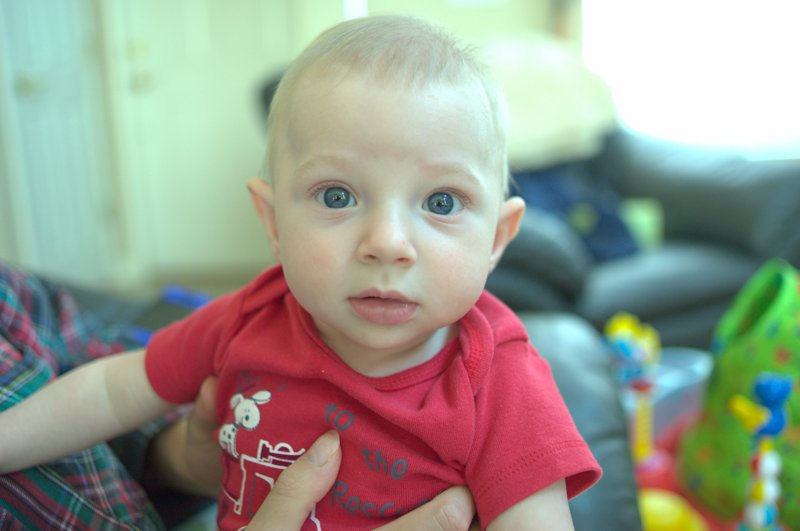

# ISP Pipeline

A from-scratch image signal processing pipeline in Python that converts raw camera sensor data (Bayer mosaic) into a finished color image. Implements the core stages found in every digital camera's ISP, without relying on any high-level RAW processing libraries for the actual image processing.

## Pipeline Stages

1. **Linearization** — Rescales raw sensor values between black and white levels, clips to [0, 1]
2. **Bayer Pattern Identification** — Automatically detects the CFA pattern (RGGB, GRBG, etc.) by analyzing pixel similarity in 2x2 neighborhoods
3. **White Balance** — Four methods: camera presets, gray world assumption, white world assumption, or manual white patch selection
4. **Demosaicing** — Separates Bayer channels and reconstructs full-color image via bilinear interpolation (implemented from scratch)
5. **Color Space Correction** — Applies camera-specific color matrix (XYZ to sRGB via camera-to-XYZ transform)
6. **Tone Mapping** — Linear brightness adjustment to target mean, followed by sRGB gamma correction

## Usage

```bash
pip install -r requirements.txt
```

Place a raw image in `data/` (supports `.nef`, `.cr2`, `.arw`, `.dng`, or pre-extracted `.tiff`), edit `config.json`, then:

```bash
python main.py                  # uses config.json
python main.py my_config.json   # uses custom config
```

## Configuration

All parameters are set in `config.json`:

```json
{
    "img_path": "data/baby.nef",
    "output_dir": "data/Outputs",
    "wb_methods": ["gray"],
    "black": 0,
    "white": 16383,
    "r_scale": 1.628906,
    "g_scale": 1.000000,
    "b_scale": 1.386719,
    "manual_coordinates": [[937, 2559]],
    "selected_coordinate_index": -1
}
```

| Field | Description |
|-------|-------------|
| `img_path` | Path to raw image file |
| `output_dir` | Where to save output images |
| `wb_methods` | White balance methods to run: `preset`, `gray`, `white`, `manual` |
| `black`, `white` | Sensor black/white levels (from `dcraw -v -w -T`) |
| `r/g/b_scale` | Camera preset white balance multipliers |
| `manual_coordinates` | Pixel coordinates of white patches for manual WB |
| `selected_coordinate_index` | Which manual coordinate to use (-1 = all) |

## Project Structure

```
main.py                  # Entry point (reads config.json)
config.json              # Pipeline parameters
isp/
  __init__.py            # Package exports
  linearize.py           # Black/white level linearization
  bayer.py               # Bayer pattern detection
  white_balance.py       # Pre- and post-demosaic white balance
  demosaic.py            # Channel separation and bilinear interpolation
  color_correction.py    # Camera color matrix correction
  tone_mapping.py        # Brightness and gamma correction
  pipeline.py            # Full pipeline orchestration
```

## Example

Input: Nikon D3400 `.nef` raw file (4284x2844, 14-bit)

Output (gray world white balance):


